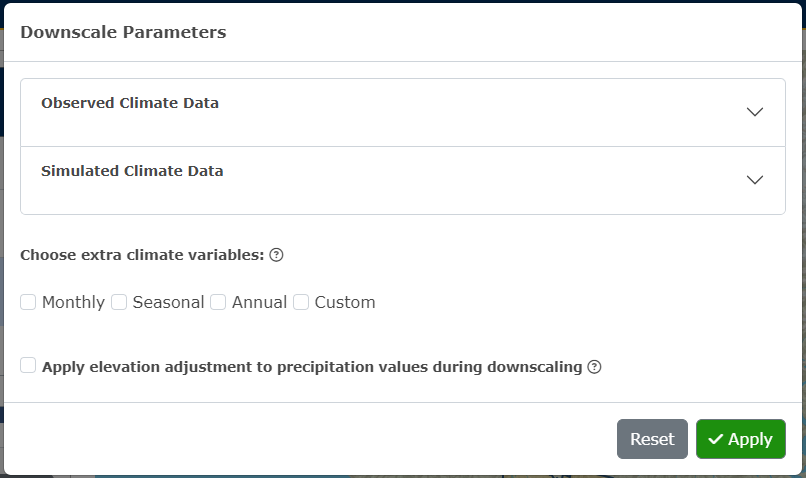
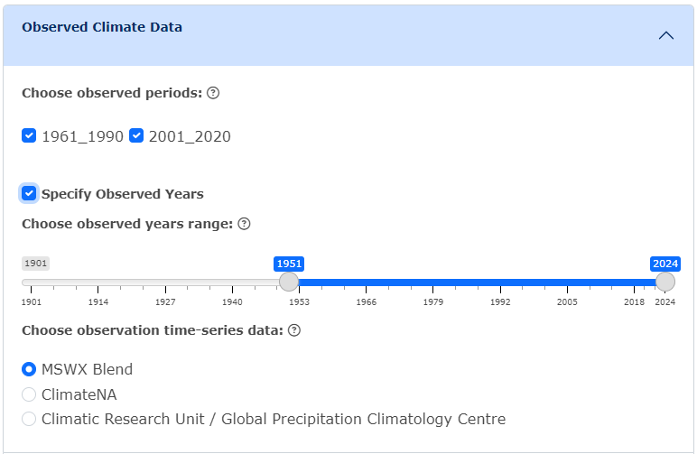
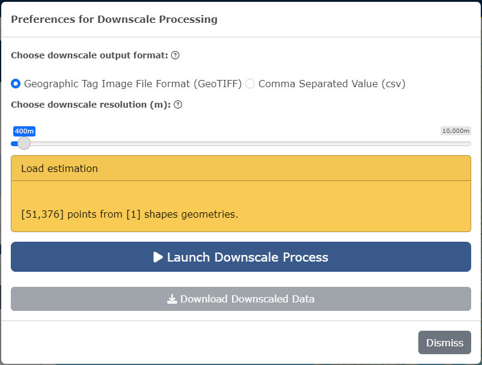
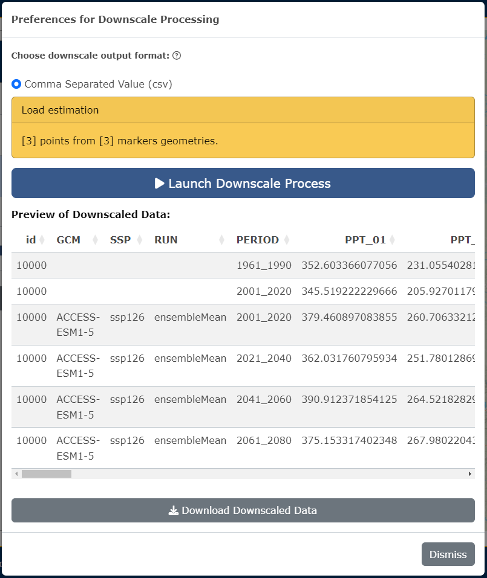
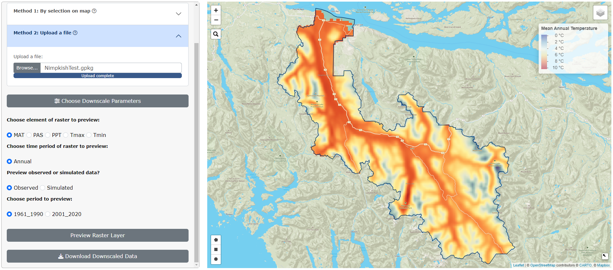
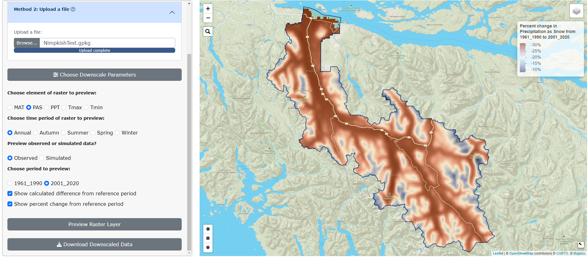

# Instructions

## Get Data:

In the first tab of the climr App, users can select points or areas of interest, choose parameters, downscale the data, and preview and download the data.  For a very quick summary of functionality of this page, users can also click the *What does this page do* link at the top of the left-hand panel.

### **Step 1.** Select points or areas of interest:

Users can select points or areas of interest using **one of the following two methods**:

-   **Method 1**. Click on the map to select a single map point or use the draw tool box in the bottom left-hand corner of the map to manually draw an area of interest.

-   **Method 2**. Upload a csv, raster or shape file.

### **Step 2.** Choose downscale parameters:

Users can select parameters by clicking the **Choose Downscale Parameters** button. These parameters are separated into two categories, **Observed Climate Data** and **Simulated Climate Data**. 

<figure style="text-align:center;">

<figcaption style="font-size: 0.8em; color: gray;">

Figure 1: Downscale Parameters

</figcaption>

</figure>

Under the **Observed Climate Data** accordion, users can select observed periods (the reference period 1961-1990 will always be computed) and choose to specify observed years and observation time-series data.

<figure style="text-align:center;">

<figcaption style="font-size: 0.8em; color: gray;">

Figure 2: Example of selected parameters for Observed Climate Data

</figcaption>

</figure>

Under the **Simulated Climate Data** accordion, users can either choose to use the recommended default settings, or manually choose the Global Climate Models (GCMs), Shared Socio-economic Pathways (SSPs), GCM period, whether or not to specify the GCM years, and choose the maximum number of model runs (please note that if 0 is selected, the ensemble mean will be used).

<figure style="text-align:center;">

<figcaption style="font-size: 0.8em; color: gray;">

Figure 3: Example of selected parameters for Simulated Climate Data

</figcaption>

</figure>

Users can then choose to select **extra climate variables**. These are organized into packages of **Monthly**, **Seasonal** and **Annual** variables, or users can choose to select custom variables by clicking **Custom** and specifying the element and seasons/months wanted. If no extra climate variables are selected, monthly PPT, Tmax, and Tmin will be computed.

<figure style="text-align:center;">

<figcaption style="font-size: 0.8em; color: gray;">

Figure 4: Example of selections for extra climate variables

</figcaption>

</figure>

Click **Apply**!

To clear all selections, click **Reset**.

### **Step 3.** Generate Results:

Click on the green **Generate Results** button. If the area of interest are map point(s) or an uploaded file of single points, the only output format available for the downscaled data is csv. If the area of interest is a map drawn shape or a shape file, users can choose between csv and GeoTIFF as the output format.

If GeoTIFF is selected, users will need to choose downscale resolution.

<figure style="text-align:center;">

<figcaption style="font-size: 0.8em; color: gray;">

Figure 5: Choosing output formats for downscaled data for a map drawn shape or shape file

</figcaption>

</figure>

Click **Launch Downscale**. Notification boxes will appear on the right-hand side of the screen while the downscale is processing, indicating each step.

If csv has been selected, a preview will appear under the Launch Downscale button, and users can choose to download the data.

<figure style="text-align:center;">

<figcaption style="font-size: 0.8em; color: gray;">

Figure 6: Example of the Preview of Downscaled Data for single map points

</figcaption>

</figure>

If GeoTIFF has been selected, raster preview options will appear on the main panel beside the map. Users can select raster to layers to preview in the area of interest on the map and click **Preview Raster Layer** to view. Users can also download the downscaled data from this panel.

<figure style="text-align:center;">

<figcaption style="font-size: 0.8em; color: gray;">

Figure 7: Example of raster preview for GeoTIFF output for Mean Annual Temperature in 1961-1990

</figcaption>

</figure>

Users can view the calculated difference between the period selected and the reference period (1961-1990).

<figure style="text-align:center;">

<figcaption style="font-size: 0.8em; color: gray;">

Figure 8: Example of calculated difference in Precipitation as Snow from 1961-1990 to 2001-2020

</figcaption>

</figure>

Users can also view the the percent change between the period selected and the reference period (1961-1990).

<figure style="text-align:center;">

<figcaption style="font-size: 0.8em; color: gray;">

Figure 9: Example of percent change in Precipitation as Snow from 1961-1990 to 2001-2020

</figcaption>

</figure>

To clear all selections on the map and start again with new data, click on the red **Clear Selections** button in the main panel.

### More information on choosing downscale parameters:

Information here about what the parameters mean??

**Observed Climate Data**:
  
  - Observed Periods:
  
  - Observed Years:
  
  - Observation Time-Series Data:
  
**Simulated Climate Data**:
  
  - Global Climate Models (GCMs):
  
  - Shared Socio-economic Pathways (SSPs):
  
  - GCM Periods:
  
  - GCM Years:
  
  - Model runs: (stuff about ensemble mean in here?)
  
  - Why use the recommended default settings?
  
**Extra climate variables**:
  
  - AHM: Annual heat/moisture index (annual)
  
  - bFFP: Beginning of the frost-free period (day of year) (annual)
  
  - CMD: Hargreaves climatic moisture deficit (mm) (annual, seasonal, monthly)
  
  - CMI: Climatic Moisture Index (cm) (annual, monthly)
  
  - DDsub0: Degree-days below 0°C (annual, seasonal, monthly)
  
  - DDsub18: Degree-days below 18°C (annual, seasonal, monthly)
  
  - DD18: Degree-days above 18°C (annual, seasonal, monthly)
  
  - DD5: Degree-days above 5°C (annual, seasonal, monthly)
  
  - eFFP: End of the frost-free period (day of year) (annual)
  
  - EMT: Extreme minimum temperature over 30 years (°C) (annual)
  
  - Eref: Hargreaves reference evaporation (mm) (annual, seasonal, monthly)
  
  - EXT: Extreme maximum temperature over 30 years (°C) (annual)
  
  - FFP: Frost-free period (mm) (annual)
  
  - MAP: Mean annual precipitation (mm) (annual)
  
  - MAT: Mean annual temperature (°C) (annual)
  
  - MCMT: Mean coldest month temperature (°C) (annual)
  
  - MSP: Growing season (May to September) precipitation (mm) (annual)
  
  - MWMT: Mean warmest month temperature (°C) (annual)
  
  - NFFD: Number of frost-free days (annual, seasonal, monthly)
  
  - PAS: Precipitation as snow (mm) (annual, seasonal, monthly)
  
  - PPT: Precipitation (mm) (annual, seasonal, monthly)
  
  - RH: Relative humidity (%) (annual, seasonal, monthly)
  
  - SHM: Summer heat/moisture index (annual)
  
  - Tave: Mean temperature (°C) (annual, seasonal, monthly)
  
  - TD: Continentality (MWMT-MCMT) (°C) (annual)
  
  - Tmax: Mean daily maximum temperature (°C) (annual, seasonal, monthly)
  
  - Tmin: Mean daily minimum temperature (°C) (annual, seasonal, monthly)

## Visualization

