# Instructions

## Get Data:

In the first tab of the climr App, users can select points or areas of interest, choose parameters, downscale the data, and preview and download the data.  For a very quick summary of functionality of this page, users can also click the *What does this page do* link at the top of the left-hand panel.

### **Step 1.** Select points or areas of interest:

Users can select points or areas of interest using **one of the following two methods**:

-   **Method 1**. Click on the map to select a single map point or use the draw tool box in the bottom left-hand corner of the map to manually draw an area of interest.

-   **Method 2**. Upload a csv, raster or shape file. For shape files, please upload a zipped folder containing all files.

### **Step 2.** Choose downscale parameters:

Users can select parameters by clicking the **Choose Downscale Parameters** button. These parameters are separated into two categories, **Observed Climate Data** and **Simulated Climate Data** (@fig-Downscale_Parameters). 

```{r}
#| label: fig-Downscale_Parameters
#| fig-cap: "Downscale Parameters"
#| fig-align: center
#| out.width: 90%
#| echo: false
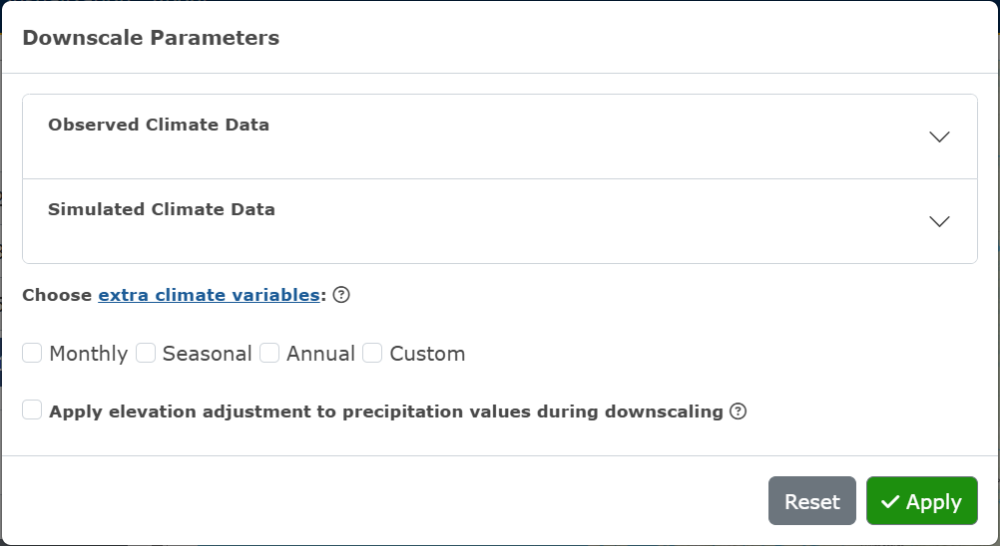
```

Under the **Observed Climate Data** accordion, users can select observed periods (the reference period 1961-1990 will always be computed). If the input is a map-drawn shape or uploaded shape file, users can choose to specify observed years and observation time-series data (@fig-Observed_Climate_Data).

```{r}
#| label: fig-Observed_Climate_Data
#| fig-cap: "Example of selected parameters for Observed Climate Data for shape input"
#| fig-align: center
#| out.width: 90%
#| echo: false
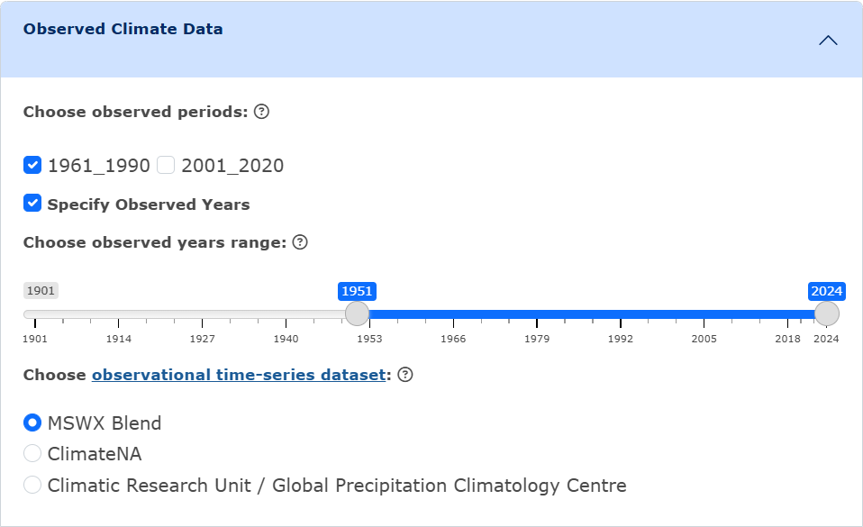
```

Under the **Simulated Climate Data** accordion, users can either choose to use the recommended default settings, or manually choose the Global Climate Models (GCMs), Shared Socio-economic Pathways (SSPs), and GCM period. If the input is a map-drawn shape or uploaded shape file, users can choose to specify the GCM years, and the maximum number of model runs (please note that if 0 is selected, the ensemble mean will be used) (@fig-Simulated_Climate_Data).

```{r}
#| label: fig-Simulated_Climate_Data
#| fig-cap: "Example of selected parameters for Simulated Climate Data for shape input"
#| fig-align: center
#| out.width: 90%
#| echo: false
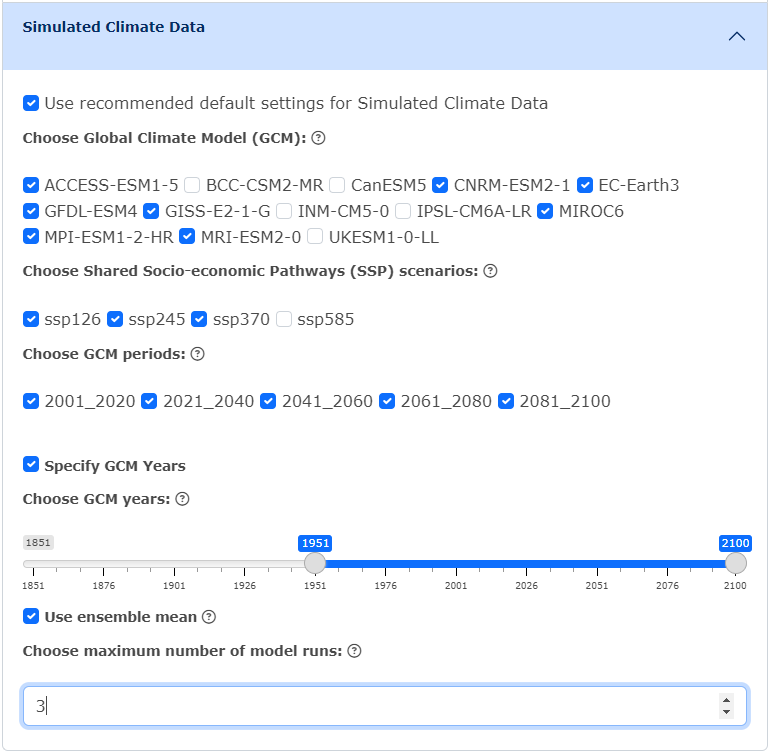
```

Users can then choose to select **extra climate variables**. These are organized into packages of **Monthly**, **Seasonal** and **Annual** variables, or users can choose to select custom variables by clicking **Custom** and specifying the element and seasons/months wanted (@fig-Extra_Climate_Variables). If no extra climate variables are selected, monthly precipitation (PPT), mean daily maximum temperature (T~max~), and mean daily minimum temperature (T~min~) will be computed.

```{r}
#| label: fig-Extra_Climate_Variables
#| fig-cap: "Example of selections for extra climate variables"
#| fig-align: center
#| out.width: 90%
#| echo: false
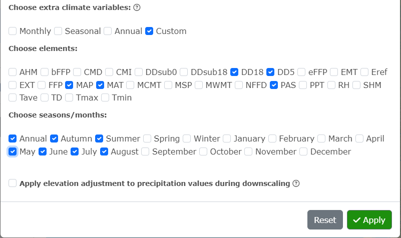
```

Click **Apply**!

To clear all selections, click **Reset**.

### **Step 3.** Generate Results:

Click on the **Generate Results** button. If the area of interest are map point(s) or an uploaded file of single points, the only output format available for the downscaled data is csv. If the area of interest is a map drawn shape or a shape file, users can choose between csv and GeoTIFF as the output format.

If GeoTIFF is selected, users will need to choose downscale resolution (@fig-GeoTIFF_downscale).

```{r}
#| label: fig-GeoTIFF_downscale
#| fig-cap: "Choosing output formats for downscaled data for a map drawn shape or shape file"
#| fig-align: center
#| out.width: 90%
#| echo: false
knitr::include_graphics("Figure_Instructions_GeoTIFF_downscale.png")
```

Click **Launch Downscale Process**. Notification boxes will appear on the right-hand side of the screen while the downscale is processing, indicating each step.

If csv has been selected, a preview will appear under the Launch Downscale Process button, and users can choose to download the data (@fig-csv_preview).

```{r}
#| label: fig-csv_preview
#| fig-cap: "Example of the Preview of Downscaled Data for single map points"
#| fig-align: center
#| out.width: 90%
#| echo: false
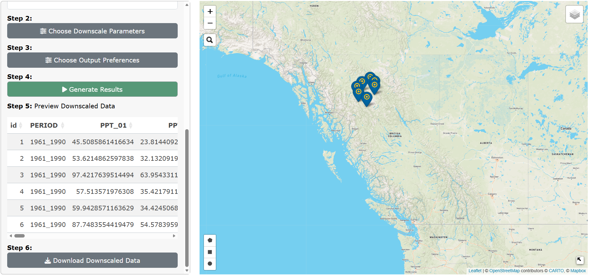
```

If GeoTIFF has been selected, raster preview options will appear on the main panel beside the map. Users can select raster to layers to preview in the area of interest on the map and click **Preview Raster Layer** to view. Users can also download the downscaled data from this panel (@fig-raster_preview_options).

```{r}
#| label: fig-raster_preview_options
#| fig-cap: "Example of raster preview for GeoTIFF output for annual mean daily maximum temperature in 1961-1990"
#| fig-align: center
#| out.width: 100%
#| echo: false
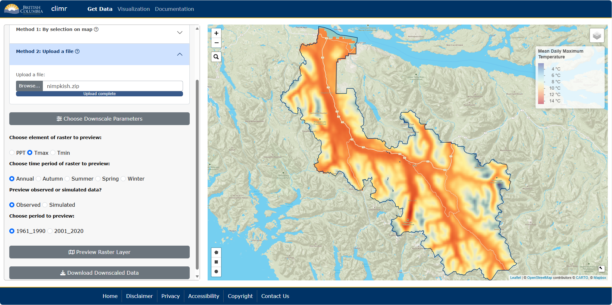
```

Users can view the calculated difference between the period selected and the reference period (1961-1990) (@fig-calculated_diff).

```{r}
#| label: fig-calculated_diff
#| fig-cap: "Example of calculated difference in Precipitation as Snow from 1961-1990 to 2001-2020"
#| fig-align: center
#| out.width: 100%
#| echo: false
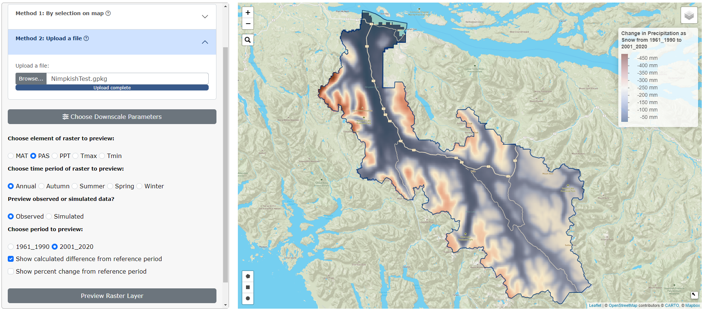
```

Users can also view the the percent change between the period selected and the reference period (1961-1990) (@fig-percent_change).

```{r}
#| label: fig-percent_change
#| fig-cap: "Example of percent change in Precipitation as Snow from 1961-1990 to 2001-2020"
#| fig-align: center
#| out.width: 100%
#| echo: false
knitr::include_graphics("Figure_Instructions_percent_change.png")
```

To clear all selections on the map and start again with new data, click on the red **Clear Selections** button in the main panel.

### Job Size Limits for Raster Output:

Currently, there are job size limits implemented on the downscaling of map-drawn shapes and uploaded shape files (see [Known Issues](Issues.qmd#issues-requiring-fixing) for more information). After a user has chosen the downscale parameters wanted and clicked **Apply**, a warning box may appear (@fig-job-size-warning). This occurs when a user has selected too many parameters, which creates too many raster layers to downscale. We recommend running the downscale process one GCM at a time if this happens; or if a user has selected multiple climate variable packages, try downscaling one package at a time.

```{r}
#| label: fig-job-size-warning
#| fig-cap: "Warning for exceeding job size limits"
#| fig-align: center
#| out.width: 50%
#| echo: false
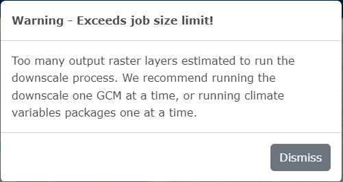
```

After clicking **Generate Results**, the available range for downscale resolution is dependent on how many raster layers will be output (@fig-low-res). If a user wants a higher resolution (the highest possible is 250m), we recommend downscaling one GCM at a time.

```{r}
#| label: fig-low-res
#| fig-cap: "Example of a limited available range for downscale resolution due to many parameters being selected for a large area"
#| fig-align: center
#| out.width: 90%
#| echo: false
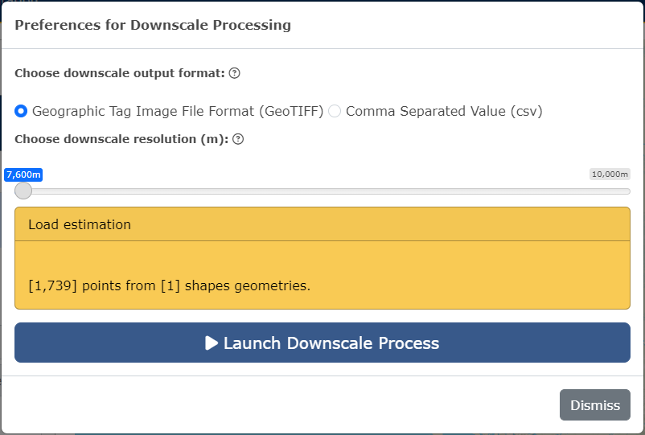
```

### More information on choosing downscale parameters:

See the [Glossary of Terms](Definitions.qmd) for the definitions of downscale parameters and climate variables.


## Visualization

In the second tab of the climr App, users can select an ecoregion of North America, an area of interest by Forest Landscape Plan (FLP) Areas, or by single map points. Users can then visualize data for the selected area by available plots (Time Series, Bivariate, Walter-Lieth). Users can also add a climate map as an overlay on North America. For a very quick summary of functionality of this page, users can click the *What does this page do* link at the top of the floating panel. For information on each plot, users can also click on the *What does this plot mean* link at the top of panel of plot parameters.

Users can also visualize climate data across all of North America by climate map overlays.

### **Step 1.** Select points or areas of interest:

Users can select points or areas of interest using **one of the following three methods**:

-   **Method 1**. Select **Ecoregion** and click on one of the outlined areas on the map. The Ecoregion names will appear as users hover over the areas.

-   **Method 2**. Select **FLP Area** and click on one of the outlined areas on the map. The FLP Area names will appear as users hover over the areas.

-   **Method 3**. Select **Map point** and click on the map to add a single point.

### **Step 2.** Visualize by plots:

Users can navigate to each plot by clicking on the plot name within the navigation bar.

#### **Ecoregion and FLP Area Plots**

Please note that these plots are **not** interactive. Whenever a user makes a change to a variable, they must click the green **Generate Plot** button to see the changes reflected on the plot.

##### **Time Series Plot:**

Choose the variable to plot by clicking on the **Element** and **Season/month** drop-down inputs. Click on the green **Generate Plot** button (@fig-Timeseries_ecoregion).

```{r}
#| label: fig-Timeseries_ecoregion
#| fig-cap: "Example of a Time Series plot for Mean daily maximum temperature for Thompson-Okanogan Plateau"
#| fig-align: center
#| out.width: 100%
#| echo: false
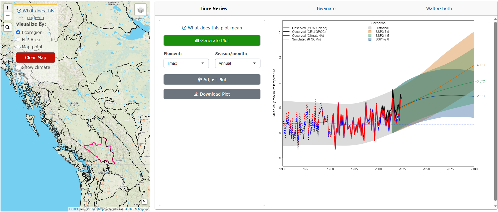
```

To adjust the plot parameters from the recommended defaults, click on the **Adjust Plot** button, select the observational dataset(s), GCM(s) and SSP(s), and click **OK!** (@fig-Timeseries_ecoregion_parameters).

```{r}
#| label: fig-Timeseries_ecoregion_parameters
#| fig-cap: "Adjust Plot parameters window for Ecoregion and FLP Area Time Series plot"
#| fig-align: center
#| out.width: 100%
#| echo: false
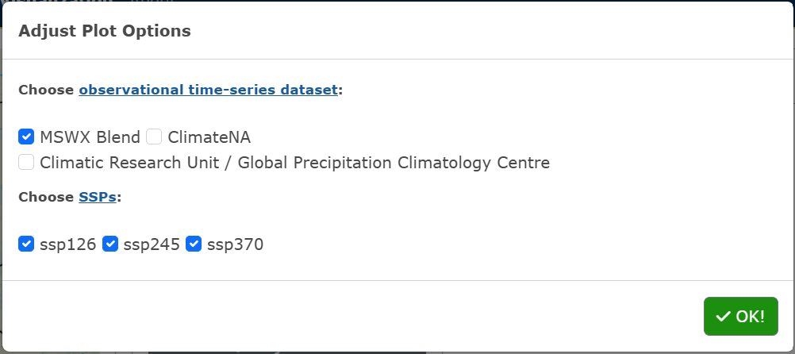
```

To download the plot as a PNG, click the **Download Plot** button.

##### **Bivariate Plot:**

Choose the x-axis and y-axis variables to plot by clicking on the **Element** and **Season/month** drop-down inputs, and the **time period**. Click on the green **Generate Plot** button (@fig-Bivariate_ecoregion).

```{r}
#| label: fig-Bivariate_ecoregion
#| fig-cap: "Example of a Bivariate plot for Change in Annual precipitation vs. Change in Mean daily maximum temperature for Chilcotin Ranges and Fraser Plateau"
#| fig-align: center
#| out.width: 100%
#| echo: false
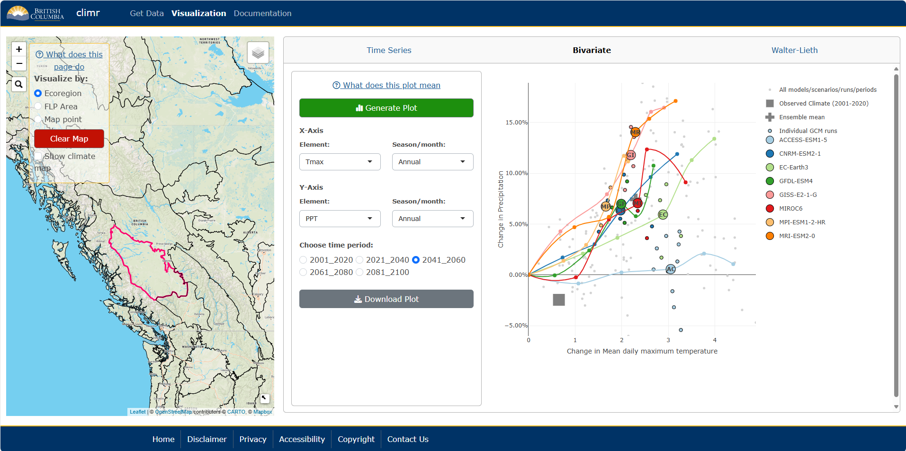
```

To download the plot as a PNG, click the **Download Plot** button.

##### **Walter-Lieth Climate Diagram:**

Choose the **observed period** and if the **diurnal range** is shown. Click on the green **Generate Plot** button (@fig-WalterLieth_flp).

```{r}
#| label: fig-WalterLieth_flp
#| fig-cap: "Example of a Walter Lieth climate diagram for Change in Annual precipitation and Change in Mean annual temperature from 1961-1990 for the Mackenzie FLP Area"
#| fig-align: center
#| out.width: 100%
#| echo: false
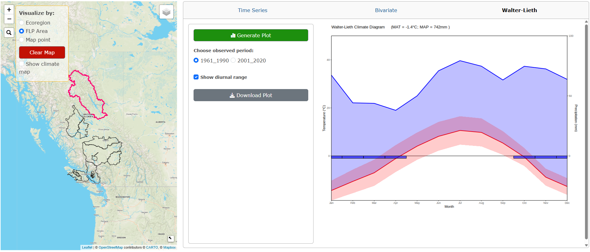
```

To download the plot as a PNG, click the **Download Plot** button.

#### **Map Point Plots**

Please note that these plots **are** interactive. Whenever a user makes a change to a variable, the plot will automatically update.

##### **Time Series Plot:**

Click on the green **Downscale Data** button. The app will downscale data for all variables available for the selected map point, this can take about a minute. Blue notification boxes will appear on the right-hand side of the screen as the downscaling is in progress and a plot will appear after the downscaling is complete (@fig-Timeseries_mappoint).

```{r}
#| label: fig-Timeseries_mappoint
#| fig-cap: "Example of a Time Series plot for Mean daily maximum temperature for a point near Burns Lake, BC"
#| fig-align: center
#| out.width: 100%
#| echo: false
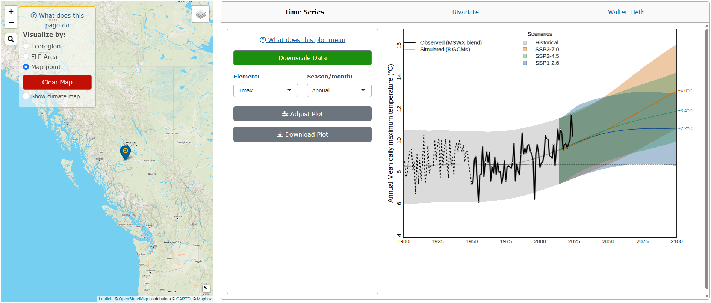
```

To change the variable plotted, select the **Element** and **Season/month** from the drop-down menus.

To adjust the plot parameters from the recommended defaults, click on the **Adjust Plot** button, select the observational dataset(s), GCM(s) and SSP(s), and click **OK!** (@fig-Timeseries_mappoint_parameters).

```{r}
#| label: fig-Timeseries_mappoint_parameters
#| fig-cap: "Adjust Plot parameters window for a map point Time Series plot"
#| fig-align: center
#| out.width: 100%
#| echo: false

```

To download the plot as a PNG, click the **Download Plot** button.

##### **Bivariate Plot:**

Click on the green **Downscale Data** button. The app will downscale data for all variables available for the selected map point and a plot will appear after the downscaling is complete (@fig-Bivariate_mappoint).

```{r}
#| label: fig-Bivariate_mappoint
#| fig-cap: "Example of a Bivariate plot for Change in Annual precipitation vs. Change in Mean daily maximum temperature for a point near Smithers, BC"
#| fig-align: center
#| out.width: 100%
#| echo: false
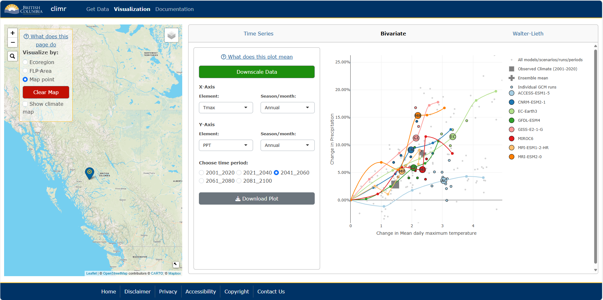
```

To change the x-axis and y-axis variables plotted, click on the **Element** and **Season/month** drop-down inputs, and the **time period**.

To download the plot as a PNG, click the **Download Plot** button.

##### **Walter-Lieth Climate Diagram:**

Click on the green **Downscale Data** button. The app will downscale data for all variables available for the selected map point and a plot will appear after the downscaling is complete (@fig-WalterLieth_mappoint).

```{r}
#| label: fig-WalterLieth_mappoint
#| fig-cap: "Example of a Walter Lieth climate diagram for Change in Annual precipitation and Change in Mean annual temperature from 1961-1990 for a point near Prince George, BC"
#| fig-align: center
#| out.width: 100%
#| echo: false
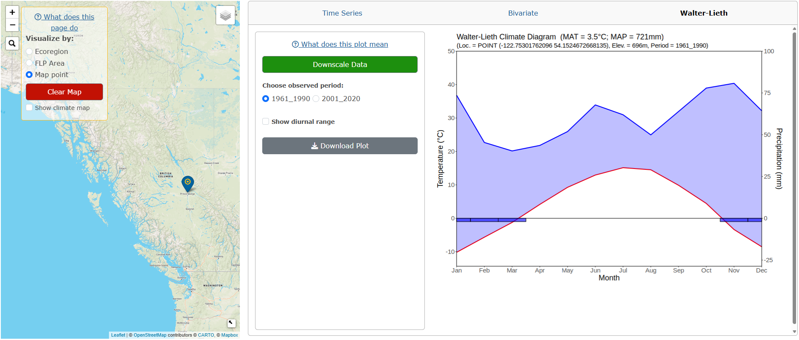
```

Users can change the **observed period** and if the **diurnal range** is shown.

To download the plot as a PNG, click the **Download Plot** button.

To clear all plots and selected points/areas, click the red **Clear Map** button.

### Climate Map Overlays:

Users can overlay a climate map onto all of North America. These maps can be displayed underneath the Ecoregion/FLP Area/map point boundaries or by itself.

Click on the **Show climate map** checkbox in the main panel and variable options for the map will appear underneath.

Choose the variable to display by selecting the **Element** and **Season** from the respective drop-down menus (@fig-Overlay_controls).

```{r}
#| label: fig-Overlay_controls
#| fig-cap: "Climate map overlay controls"
#| fig-align: center
#| out.width: 25%
#| echo: false
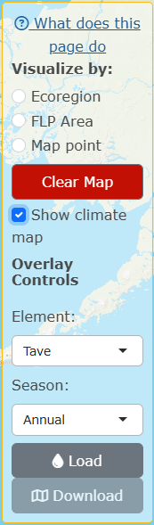
```

Click **Load**. The map will take about 5-10 seconds to render (@fig-Overlay_Tave).

```{r}
#| label: fig-Overlay_Tave
#| fig-cap: "Climate map of annual Mean temperature (in °C) across North America"
#| fig-align: center
#| out.width: 100%
#| echo: false
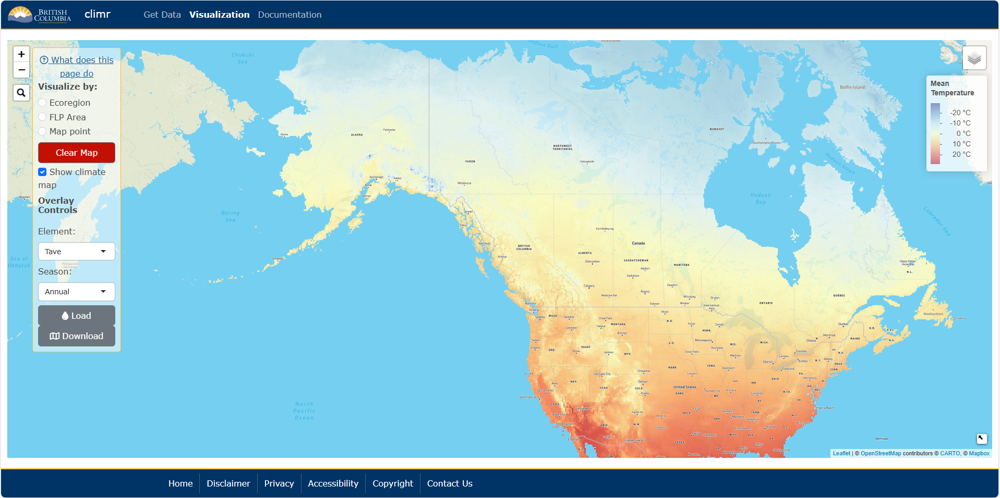
```

For ratio variables, an **Apply scale adjustment** checkbox will appear, which applies a log scale adjustment to the data.

To download the climate map, click **Download**.

To remove the overlay, click on the red **Clear Map** button.


