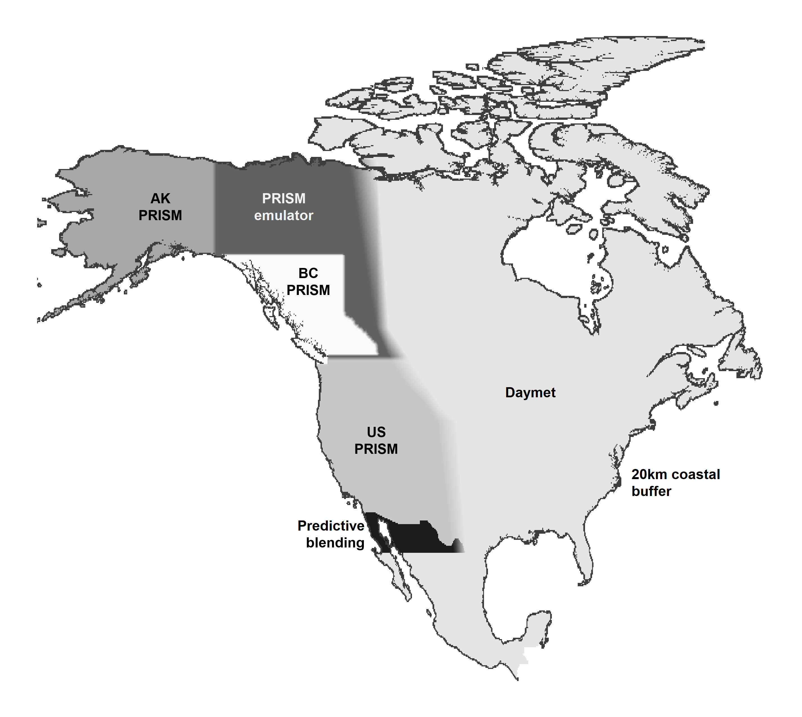
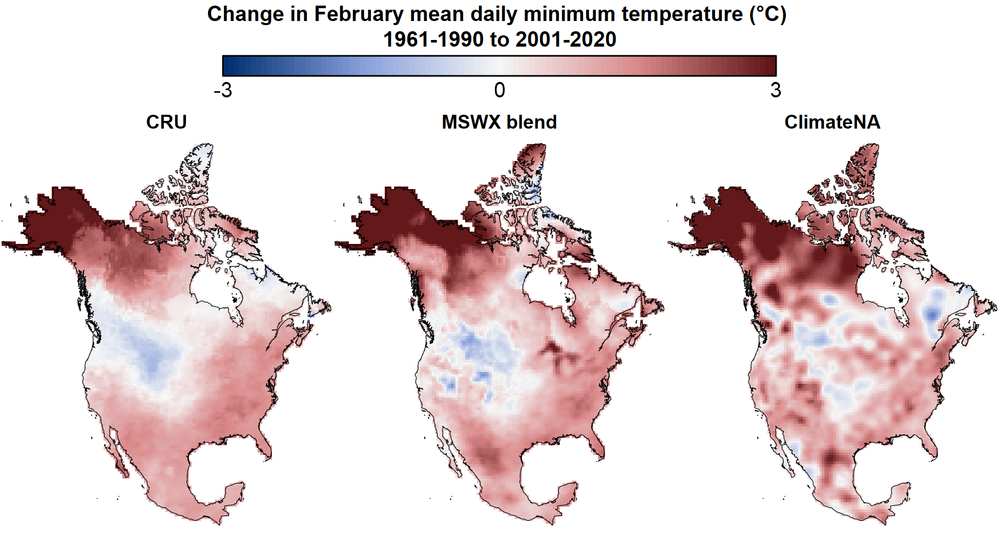
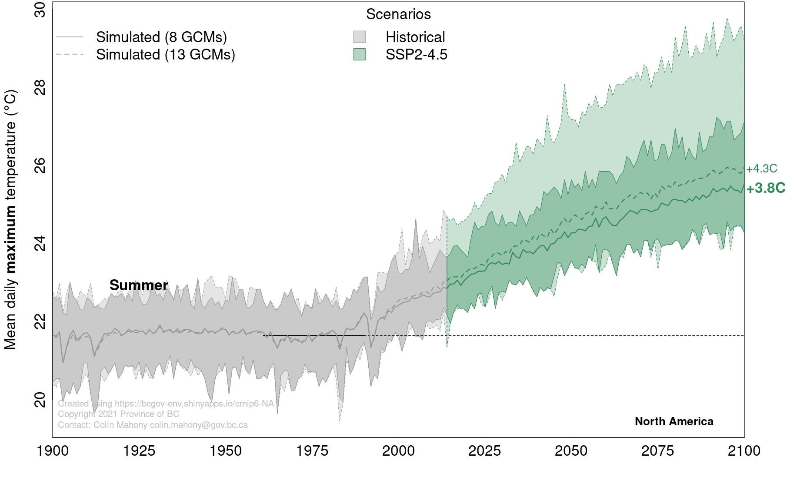

# Methods

## climr downscaling methods

Downscaling is the process of converting low-spatial-resolution climate data to high resolution. `climr` adapts a downscaling approach originally implemented in [ClimateNA](https://climatena.ca/) (@wang2016) by Dr. Tongli Wang (University of British Columbia), Dr. Andreas Hamann (University of Alberta), and Dave Spittlehouse (BC Ministry of Forests). This approach downscales climate data in three stages:

1.  *Change-factor downscaling* of coarse-resolution (50-200km grid) monthly temperature and precipitation data from climate models or observational sources to high-resolution (1-4km grid);
2.  *Elevation adjustment* of temperature variables to provide scales finer than the high-resolution reference grid; and
3.  *Calculating derived variables* (e.g. degree-days and precipitation as snow) from the downscaled monthly temperature and precipitation variables.

### Stage 1: change-factor (aka "delta") downscaling

`climr` uses a simple method called change-factor downscaling. This method adds low-spatial-resolution anomalies (e.g., from a climate model) to a high-resolution gridded climate map (Tabor and Williams 2010). While change-factor downscaling is too simplistic for downscaling of daily time series or extremes indices, it is sufficient for downscaling temperature and precipitation data at low temporal resolution (e.g., 20-year climate averages).

The default high-resolution climate maps used by `climr` are 800m gridded maps of mean daily maximum temperature (T~max~), mean daily minimum temperature (T~min~), and precipitation (PPT) for the 1961-1990 period. Global climate model data are at much lower resolution (60-200km grid scale). To downscale the GCM projection, we first interpolate the low-resolution GCM anomaly (e.g., the temperature change from 1961-1990 to 2041-2060) to the resolution of the detailed reference climate map. Then we add these smoothed anomalies to the high-resolution 1961-1990 climate map, resulting in a high-resolution map of the simulated climate in the future period (e.g., 2041-2060). In the case of precipitation, we multiply the reference climate by the relative anomaly (e.g., multiply by 1.07 for a 7% increase in precipitation), rather than adding the absolute anomaly.

### Stage 2: Elevation adjustment

`climr` uses elevation adjustment to downscale temperature variables to scales finer than the resolution of the reference climate map. It does this by inferring a relationship between temperature and elevation, known as a lapse rate, from the reference climate maps. The local lapse rate is calculated for each grid cell of the reference climate map using a linear regression of temperature to elevation among the focal cell and its 8 neighbours. This lapse rate is then added to the difference between the user-supplied elevation and the elevation of the climr reference map. 

Elevation adjustment provides a visually appealing map and can be useful in improving precision in climate values for points of interest in areas of steep topography. However, it is important to remember that the `climr` output only represents the effects of regional climate and elevation. Microclimatic factors such as aspect, vegetation, water bodies, frost pooling, and soil moisture are not represented in these maps. 

By default, `climr` doesn't apply elevation adjustment to precipitation, because in most cases elevation does not influence precipitation at scales less than 2km. Instead, precipitation at scales finer than 2.5m is simply interpolated from the nearest four grid points in the reference map. Users can choose to apply elevation-adjustment to precipitation in the `Downscale Parameters` dialogue box. 

### Stage 3: Derived variables

The value of delta downscaling isn't just in obtaining the new absolute values of temperature and precipitation. It allows us to calculate anomalies in other indices that don't scale linearly with temperature or precipitation, such as degree-days or precipitation as snow. `climr` currently uses the ClimateNA derived variable equations (@wang2016). These equations are developed by fitting non-linear models of the relationship between the variable of interest calculated from daily weather station data and monthly temperature and/or precipitation at these weather stations. 

### Full article

For more details and illustrations of the `climr` downscaling method, see the [full article](https://bcgov.github.io/climr/articles/methods_downscaling.html). 

## The climr baseline climatologies

High-quality gridded climatologies (climate maps) of North America are not currently available, despite the availability of high-quality climate maps for BC and the continental US (the PRISM maps; @daly2008). Existing seamless maps made with a consistent methodology across North America (WorldClim, Daymet, and CHELSA) exhibit unacceptable artefacts, **which are unrealistic patterns in the data**, in the complex topography of the western Cordillera. For this reason, we developed a mosaic of climatologies for use as climr's baseline (reference) maps of temperature and precipitation. 

The climr mosaic is a composite of the 1981-2010 gridded climate maps from the following sources (@fig-climr_mosaic_dataSources): 

- **PRISM for Western US**---The Parameter-elevation Regressions on Independent Slopes Model (PRISM; @daly2008) maps are recognized as the highest-quality gridded climatological normals for the contiguous United States. We blended the US PRISM with BC PRISM emulator (explained below) between latitudes 48^o^N and 49^o^N.

- **British Columbia PRISM**---The BC PRISM (@pcic2014) is developed by the [Pacific Climate Impacts Consortium](pacificclimate.org/data/prism-climatology-and-monthly-timeseries) in collaboration with the PRISM Climate Group (Oregon State University). It generally is highly compatible with the US and Alaska PRISM products, with exceptions noted in the [Discussion section](#apparent-tmin-artefacts-in-the-us-prism). The blending with the PRISM emulator along the northern, eastern, and southern BC boundary does not compromise the integrity of the BC PRISM since the emulator replicates the PRISM map in the blending region.

- **British Columbia PRISM**---The BC PRISM (@pcic2014) is developed by the [Pacific Climate Impacts Consortium](https://pacificclimate.org/data/prism-climatology-and-monthly-timeseries) in collaboration with the PRISM Climate Group (Oregon State University). It generally is highly compatible with the US and Alaska PRISM products, with exceptions noted in the [Discussion section](https://bcgov.github.io/climr/articles/methods_mosaic.html#discussion-and-known-issues) of the full article. The blending with the PRISM emulator along the northern, eastern, and southern BC boundary does not compromise the integrity of the BC PRISM since the emulator replicates the PRISM map in the blending region.

- **Alaska PRISM**---The PRISM 1981-2010 climatological maps for Alaska [(Daly et al. 2018)](https://prism.oregonstate.edu/projects/public/alaska/report/ak_final_report_8110.pdf) are the best available product, as a result of exhaustive station data compilation and local expert review, and are compatible with the BC PRISM.

- **Daymet for eastern North America and Mexico**---While the US PRISM is likely preferable to Daymet over the continental US, Daymet (@thornton2021) provides north-south continuity across Canada, USA, and Mexico. Daymet was chosen over other North American gridded climatologies (WorldClim and CHELSA) due to its relative quality and the availability of a 1981-2010 normal period.

- **PRISM Emulator in Yukon and Northwest Territories**---We evaluated all available climatological maps for the Yukon and Northwest Territories (WorldClim, CHELSA, Daymet, NRCAN ANUSPLIN, and Western Canadian 4km 1961-1990 PRISM). None of these products were of acceptable quality due to very low weather station density. To provide a PRISM-compatible estimation of climate in this region, we trained deep learning models on the BC and Alaska PRISM maps and predicted them into the Yukon and NWT. 

- **Predictive blending in Northern Mexico**---The US PRISM and Daymet maps require blending at the US-Mexico border to avoid boundary artefacts. Rather than blending Daymet into the US PRISM, which would degrade the PRISM map, we used machine learning (Random Forest regression) to interpolate between PRISM and Daymet in a broad swath of Northern Mexico. This is a less sophisticated approach to PRISM emulation than used in the Yukon and NWT, but it is much more computationally efficient and produced acceptable results. 

- **20km Coastal buffer**---We extended the coastal climate values outwards into the ocean to a distance of 20km from shore. We retained existing coastal buffers present in the PRISM products and extended their outer limit where necessary. This buffer ensures climate values are available in outer coastal land areas, but is not intended to estimate temperature and precipitation over the ocean. 

```{r}
#| label: fig-climr_mosaic_dataSources
#| fig-cap: "Elements of the climr mosaic of 1981-2010 climatologies. PRISM and Daymet are publicly available datasets. The PRISM Emulator and predictive blending were developed as part of the climr mosaic method and are described in this article. Blending between products is as shown."
#| fig-align: center
#| out.width: 90%
#| echo: false

```

### Full article

For more details and illustrations of the climr baseline climatologies, see the [full article](https://bcgov.github.io/climr/articles/methods_mosaic.html). 


## Historical time series

The climr App provides access to three observational time series datasets of historical temperature and precipitation: 

1.	CRU/GPCC: The 1901-2023 combined Climatic Research Unit TS dataset (CRU; @harris2020cruts) for temperature and Global Precipitation Climatology Centre dataset (GPCC; @becker2013gpcc) for precipitation; 
2.	MSWX blend: The 1981-2024 Multi-Source Weather (MSWX; @beck2022mswx) for temperature and Multi-Source Weighted-Ensemble Precipitation (MSWEP; @beck2019mswep) for precipitation, which we have extended back to 1901 using the CRU/GPCC dataset; and 
3.	ClimateNA: The 1901-2023 ClimateNA time series (@wang2024monthly). 

Our analysis to date indicates substantial differences between these datasets (@fig-Figure_Methods_obsTS_compare), and that each has weaknesses. CRU/GPCC are compromised by the post-1990s decline in station density, while ClimateNA exhibits apparent interpolation artefacts **, artificial patterns that don't exist in the real climate,** with large impacts on the detected climate change trend. The MSWX blend produces credible trends for temperature and precipitation, but has likely artefacts in precipitation trends in the arctic. The MSWX blend is the most conceptually appealing approach to gridded time series because the gridpoints without station observations are informed by physical weather modeling. However, a more detailed validation would be required to establish MSWX as a preferred product. In the meantime, we are using the MSWX-blend for the 2001-2020 observed normals as well as for transferring the 1981-2010 climr climatological mosaic to the 1961-1990 baseline period. We recommend using the MSWX-blend as the primary.

```{r}
#| label: fig-Figure_Methods_obsTS_compare
#| fig-cap: "Comparison of the CRU, MSWX-blend, and ClimateNA gridded time series in terms of the difference between the 1961-1990 and 2001-2020 average February Tmin."
#| fig-align: center
#| out.width: 90%
#| echo: false

```


### Full article

For more details on the gridded observational time series datasets, see the [full article](https://bcgov.github.io/climr/articles/guidance_timeSeries.html). 


## Global climate model ensemble selection

Wherever possible, climate change studies will benefit from the use of
projections from multiple models to assess modeling uncertainties. There
is broad scientific agreement that an ensemble of at least eight
independent climate models are required to represent modeling
uncertainties about climate change outcomes over large regions. 

@mahony2022 recommend an ensemble of 8 models for ensemble analysis. This 8-model ensemble is more
consistent with the IPCC's assessment of climate sensitivity than the
full 13-model `climr` ensemble (@fig-Figure_Methods_cmip6NA_NAM_Tmax_sm2), and excludes a model with problematic
spatial artefacts in BC Coast Mountains. The recommended 8-model
ensemble is: ACCESS-ESM1.5, CNRM-ESM2-1, EC-Earth3, GFDL-ESM4,
GISS-E2-1-G, MIROC6, MPI-ESM1.2-HR, and MRI-ESM2.0.

```{r}
#| label: fig-Figure_Methods_cmip6NA_NAM_Tmax_sm2
#| fig-cap: "Comparison of the ClimateNA 13-model ensemble (dashed lines) and 8-model ensemble (solid lines) for the SSP2-4.5 scenario. The variable is mean summer daily maximum temperature (tasmax/Tmax_sm) averaged over North America. The 8-model ensemble excludes models with ECS outside the IPCC-assessed 2-5^o^C range."
#| fig-align: center
#| out.width: 90%
#| echo: false

```

For more details on the climr global climate model ensemble selection, see the [full article](https://bcgov.github.io/climr/articles/methods_ensembleSelection.html). 


## References

